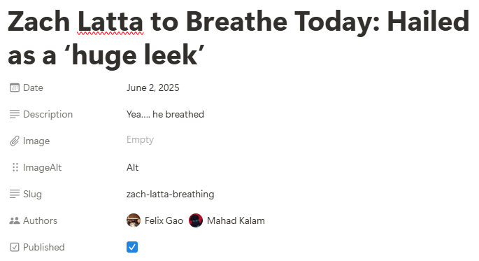

# Contributing

Thanks so much for contributing to this site! :) This site is built off Astro.

> **Fyi! ⚠️** This project is a work-in-progress (WIP), so don't contribute to anything yet as everything is subject to heavy change

## Getting Started

### Setting up the Notion database

First, let's clone the Notion database template:

- [Open the Notion template link](https://justhypex.notion.site/2068a02c5e54801fa518d851f20d04a0?v=2068a02c5e5481788205000c3b00c66f&source=copy_link)
- Click the `Duplicate` button next to the three dots
- Select a workspace to clone the database to (you might need to sign in first)

Your Notion database should look like this:



Next, let's get the database ID from the URL:

```text
https://www.notion.so/justhypex/2028a02c5e54804d9fb3f3e05276a724?v=...

// here, the database ID is 2028a02c5e54804d9fb3f3e05276a724
```

Hang on to this database ID, we'll need it later.

### Setting up the Notion integration

>![IMPORTANT]
>
> You need to be an admin of the Notion workspace to set up the integration.

Now, let's create a Notion integration so we can fetch data from the database:

- Visit [Notion's integration dashboard](https://www.notion.so/profile/integrations)
- Click `+ New integration`
- Add a name for the integration (e.g. `Newspaper`)
- Visit the `Configuration` tab and copy the `Internal Integration Secret`. This is your Notion token.
- Add the integration to your database page:
  - Click on the `...` More menu in the top-right corner of the page.
  - Scroll down to `+ Add Connections`
  - Search for your integration and select it
  - Confirm the integration can access the page and all of its child pages

### Setting up your local environment

Get started by running the following:

```bash
git clone https://github.com/hackclub/newspaper.git && cd newspaper
```

We use [Bun](https://bun.sh) for package management, so ensure that you have it installed.

Install dependencies:

```bash
bun install
```

Copy the `.env.example`, then fill in the `.env`:

```bash
cp .env.example .env
```

It's showtime! Run the following to start the development server:

```bash
bun run dev
```

## Adding a Notion property

First, update `src/content.config.ts` to add the new property to the `schema.properties` object.

```ts
import { z } from "astro:content";
import { defineCollection } from "astro:content";
import { notionLoader } from "notion-astro-loader";
import {
  notionPageSchema,
  transformedPropertySchema,
} from "notion-astro-loader/schemas";

const posts = defineCollection({
  // ...
  schema: notionPageSchema({
    properties: z.object({
      Name: transformedPropertySchema.title,
      // ...

      Foo: transformedPropertySchema.rich_text,

      // ^^^^
    }),
  }),
});

export const collections = { posts };
```

Check out the `notion-astro-loader` docs for more information on how to add a new property. Ensure you add a transform function to the property in the `schema.properties` object.
For transform functions, this file is [a good reference](https://github.com/NotWoods/travel/blob/main/packages/notion-astro-loader/src/schemas/transformed-properties.ts)!

Finally, **make sure you update this file** (`CONTRIBUTING.md`) to add the new property to the list of properties!

## General tips

- Place your assets in the `src/assets` folder, unless there's a good reason to put them somewhere else. (But nine times out of ten, you should put them in `src/assets`!)
  The reason for this is because Astro can properly optimize the images to ensure they load as fast as possible.
- File names should be in `kebab-case`.

  ```text
  /src/components/test.astro // ✅
  /src/components/Test.astro // ❌
  /src/components/testComponent.astro // ❌
  ```

- If you need help, feel free to DM someone on the Newspaper Team! We're more than happy to help you out and guide you along the way :)
